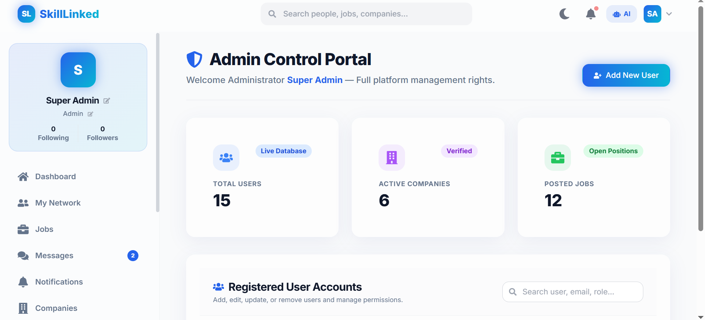
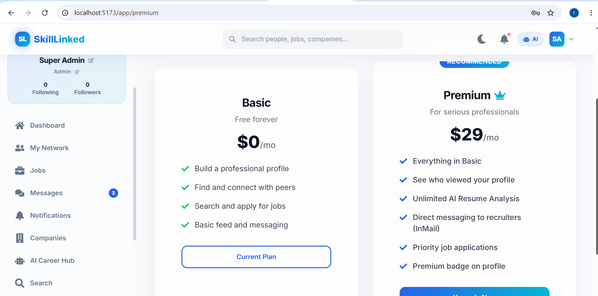

<div align="center">


<h1>🚀 SkillLinked</h1>

<p align="center">
  <strong>The Next-Generation AI-Powered Professional Networking Platform</strong><br/>
  <em>Intelligent networking · AI-driven job matching · Premium SaaS aesthetics</em>
</p>

<p align="center">
  
  
  
  
  
  
</p>

<p align="center">
  
  
  
  
</p>

<br/>

<!-- Hero Image -->


</div>

---

## 📖 Table of Contents

- [About the Project](#-about-the-project)
- [Project Gallery](#-project-gallery)
- [Key Features](#-key-features)
- [Architecture & Tech Stack](#-architecture--tech-stack)
- [Project Structure](#-project-structure)
- [Getting Started](#-getting-started)
- [Environment Variables](#-environment-variables)
- [API Documentation](#-api-documentation)
- [Roadmap & Future Scope](#-roadmap--future-scope)
- [Contributing](#-contributing)
- [License](#-license)

---

## 🌟 About the Project

**SkillLinked** is a modern, full-stack professional networking platform that bridges the gap between talent and opportunity. Drawing inspiration from industry leaders like LinkedIn, SkillLinked introduces a premium user interface with **glassmorphism**, robust **AI-assisted career insights**, and seamless **real-time communication**. 

Whether you are an individual looking to expand your network, a company seeking top-tier candidates, or an administrator managing the platform, SkillLinked offers an intelligent, integrated ecosystem designed for growth.

---

## 📸 Project Gallery

Here are some glimpses of the SkillLinked application interface. 

*(**Note:** The images you provided have been integrated here. Ensure they are saved in the `docs/screenshots/` folder with these names).*

<div align="center">
  
  
</div>
<br/>
<div align="center">
  
  
</div>

---

## 🔥 Key Features

### 👤 User & Profile Management
- **Multi-Identifier Login:** Authenticate seamlessly using Email, Username, Phone, or Full Name.
- **Role-Based Access Control:** Distinct experiences and panels for Users, Companies, and Super Admins.
- **Dynamic Profiles:** Comprehensive resume support, dynamic skill tagging, and interactive profile completion metrics.

### 💼 Career & Job Hub
- **AI-Powered Matching:** Intelligent job recommendations tailored to user profiles and skills.
- **Advanced Filtering:** Pinpoint opportunities by type (Full-time, Contract, etc.) and location (Remote, Hybrid, On-site).
- **Premium Tier:** Upgraded features including AI Resume Analysis, visibility on profile views, and priority applications.

### 💬 Seamless Communication
- **Real-Time Messaging:** Instant, lag-free chat powered by Socket.io, featuring unread badges and online statuses.
- **Professional Feed:** Create, share, and interact with professional posts across your network.
- **Connection Management:** Discover network suggestions and efficiently manage follower/following dynamics.

### 🛡️ Admin & Security
- **Comprehensive Admin Portal:** Real-time metrics, active company verifications, and user management tools for administrators.
- **Robust Security:** JWT-based access and refresh tokens, bcrypt password hashing, and secure API rate limiting.

---

## 🛠 Architecture & Tech Stack

SkillLinked follows a robust, decoupled **Client-Server** architecture to ensure high scalability and optimal performance.

### 🖥️ Client (Frontend)
- **Core:** React 18, Vite
- **State Management:** Redux Toolkit
- **Routing:** React Router v6
- **Styling:** Tailwind CSS, Framer Motion (for fluid, dynamic animations)
- **Real-Time:** Socket.io Client
- **HTTP Client:** Axios

### ⚙️ Server (Backend)
- **Core:** Node.js, Express.js
- **Database:** MongoDB & Mongoose (ODM)
- **Real-Time Engine:** Socket.io
- **Authentication:** JSON Web Tokens (JWT), bcrypt.js
- **File Management:** Multer & Cloudinary Integration
- **AI Integration:** OpenAI API (or similar) for Resume Scoring & Insights

---

## 📂 Project Structure

A high-level overview of the monolithic repository structure:

```text
skilllinked/
├── client/                     # Frontend React Application
│   ├── public/                 # Static assets
│   ├── src/
│   │   ├── assets/             # Images, SVGs, etc.
│   │   ├── components/         # Reusable UI components
│   │   ├── features/           # Redux slices and state management
│   │   ├── hooks/              # Custom React hooks
│   │   ├── pages/              # Route components (Dashboard, Login, etc.)
│   │   ├── services/           # API calls and Axios instances
│   │   ├── utils/              # Helper functions
│   │   ├── App.jsx             # Main application component
│   │   └── main.jsx            # React entry point
│   ├── .env.example            # Example environment variables (No secrets)
│   ├── package.json
│   └── tailwind.config.js
│
├── server/                     # Backend Express Application
│   ├── src/
│   │   ├── config/             # DB & third-party integrations (Cloudinary)
│   │   ├── controllers/        # Request handlers (AI, Connection, Company, etc.)
│   │   ├── middlewares/        # Custom middlewares (Auth, Error handling)
│   │   ├── models/             # Mongoose schemas (User, Job, etc.)
│   │   ├── routes/             # API routes
│   │   ├── utils/              # Helper functions (Token generation, etc.)
│   │   └── server.js           # Express app entry point
│   ├── .env.example            # Example environment variables (No secrets)
│   └── package.json
│
├── docs/                       # Documentation and assets
│   └── screenshots/            # Project screenshots
├── .gitignore
└── README.md
```

---

## 🚀 Getting Started

Follow these instructions to set up the project locally on your machine.

### Prerequisites

Ensure you have the following installed:
- [Node.js](https://nodejs.org/en/download/) (v18.0.0 or higher)
- [MongoDB](https://www.mongodb.com/try/download/community) (Local instance or MongoDB Atlas URI)
- Git

### Installation

1. **Clone the repository**
   ```bash
   git clone https://github.com/Rim-sha47/skilllinked.git
   cd skilllinked
   ```

2. **Setup the Backend Server**
   ```bash
   cd server
   npm install
   ```
   *Next, create your `.env` file (see [Environment Variables](#-environment-variables)) and then run:*
   ```bash
   npm run dev
   ```
   > The API will be accessible at `http://localhost:5000/api`

3. **Setup the Frontend Client**
   ```bash
   cd ../client
   npm install
   ```
   *Next, create your `.env` file and then run:*
   ```bash
   npm run dev
   ```
   > The application will be accessible at `http://localhost:5173`

---

## 🔐 Environment Variables

To keep your personal data and secrets secure, **NEVER** commit your `.env` files to GitHub. We use `.env` files to hide sensitive information like passwords, Client IDs, and Secret Keys. 

You must create a `.env` file in both the `server` and `client` directories using the formats below.

**`/server/.env`**
```env
# Server Configuration
NODE_ENV=development
PORT=5000

# Database Configuration (Hide your real connection string)
MONGO_URI=<YOUR_MONGODB_CONNECTION_STRING>

# Authentication Secrets (Use strong, random strings)
JWT_SECRET=<YOUR_SECURE_JWT_ACCESS_SECRET>
JWT_REFRESH_SECRET=<YOUR_SECURE_JWT_REFRESH_SECRET>

# Third-Party API Keys (Keep these hidden!)
CLOUDINARY_CLOUD_NAME=<YOUR_CLOUDINARY_CLOUD_NAME>
CLOUDINARY_API_KEY=<YOUR_CLOUDINARY_API_KEY>
CLOUDINARY_API_SECRET=<YOUR_CLOUDINARY_API_SECRET>

# AI Services (e.g., OpenAI API Key)
AI_CLIENT_ID=<YOUR_AI_CLIENT_ID>
AI_SECRET_KEY=<YOUR_AI_SECRET_KEY>

# Super Admin Provisioning
ADMIN_EMAIL=<YOUR_ADMIN_EMAIL>
ADMIN_PASSWORD=<YOUR_ADMIN_PASSWORD>
ADMIN_NAME=<YOUR_ADMIN_NAME>
```

**`/client/.env`**
```env
# API Endpoint
VITE_API_BASE_URL=http://localhost:5000/api
```

---

## 📡 API Documentation

Below is a high-level overview of the exposed RESTful endpoints.

### Authentication & Authorization
- `POST /api/auth/register/user` - Register a new user
- `POST /api/auth/login/user` - Authenticate a user and receive tokens
- `POST /api/auth/refresh` - Obtain a new access token
- `POST /api/auth/logout` - Invalidate current session

### Profile & Networking
- `GET /api/profiles/me` - Fetch authenticated user profile
- `POST /api/connections/request/:userId` - Send a network connection request
- `GET /api/connections/suggestions` - Discover potential connections

### Job Board
- `GET /api/jobs` - Retrieve job listings with applied filters
- `POST /api/jobs/:id/apply` - Submit an application for a specific job

> For the complete and detailed API specifications, please refer to the Postman/Swagger documentation.

---

## 🗺 Roadmap & Future Scope

- [ ] **v2.1**: Full integration of OAuth 2.0 (Google & GitHub).
- [ ] **v2.2**: AI-Powered Resume Scoring using OpenAI APIs.
- [ ] **v2.3**: In-app Video Conferencing via WebRTC for remote interviews.
- [ ] **v2.4**: Premium Tier Subscription model powered by Stripe.
- [ ] **v2.5**: Cross-platform Mobile Application using React Native.

---

## 🤝 Contributing

We welcome contributions from the open-source community! To contribute:

1. Fork the Project
2. Create your Feature Branch (`git checkout -b feature/AmazingFeature`)
3. Commit your Changes (`git commit -m 'Add some AmazingFeature'`)
4. Push to the Branch (`git push origin feature/AmazingFeature`)
5. Open a Pull Request

---

## 📜 License

Distributed under the MIT License. See `LICENSE` for more information.

---

<div align="center">
  <br/>
  <h3>👩‍💻 Developed with ❤️ by Rimsha</h3>
  <p>Full-Stack Developer | Innovator</p>
  
  <a href="https://github.com/Rim-sha47">
    
  </a>
</div>
